# **Xeno CRM Backend**This is the backend for the **Xeno CRM** project, built using **Node.js**, **Express**, and **MongoDB**. The backend provides APIs for managing customers, orders, campaigns, and vendor communication.---


## **Project Overview**
The backend provides the following features:
- Customer and order management.
- Campaign creation and delivery.
- Integration with a dummy vendor API for message delivery.
- Google OAuth for authentication.

---

## **Technologies Used**
- **Node.js**: Backend runtime.
- **Express.js**: Web framework.
- **MongoDB**: Database for storing customer, order, and campaign data.
- **Passport.js**: Google OAuth authentication.
- **Axios**: HTTP client for API calls.

---

## **Setup Instructions**
1. Clone the repository:
   ```bash
   git clone <repository-url>
   cd backend```

2. Install dependencies:
   ```bash
   npm install

3. Create a .env file in the root directory and add the following
   ```bash
   DATABASE_URI=<your-mongodb-uri>
   PORT=5000
   JWT_SECRET=<your-jwt-secret>
   VENDOR_API_URL=https://681f05b8c1c291fa6635bf73.mockapi.io/CrmVendor/messages

4. Start the server:
   ```bash
   npm run dev
5. The server will run at http://localhost:5000.


**Database Models**
1. Customer Schema

- **Description**: Stores customer details such as name, email, contact, and spending data.

- **Screenshot**
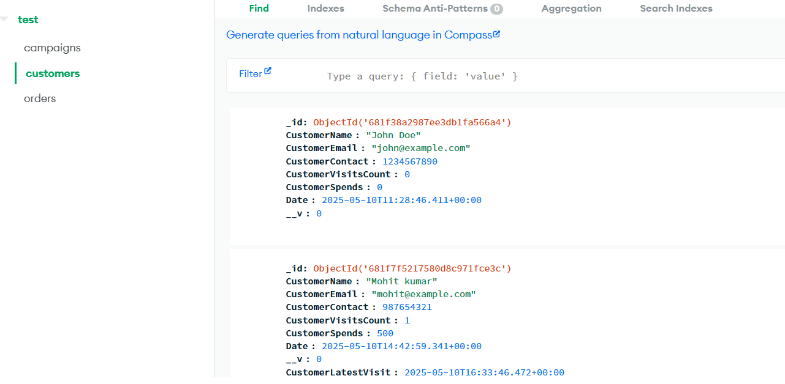
##

2. Order Schema


- **Description**: Stores order details, including the customer reference, total orders, and amount spent.

- **Screenshot**
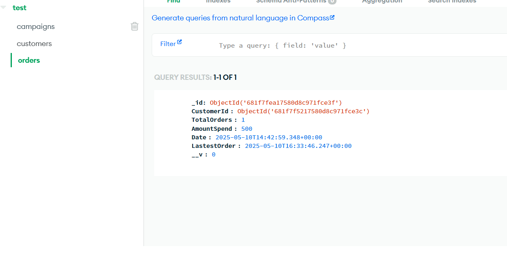

##

3. Campaign Schema


- **Description**: Stores campaign details, including the audience and current status..

- **Screenshot**


#

**API Endpoints**

**1. Create Customer**

- **Method:** `POST`  
- **URL:** `/api/v1/createCustomer`  
- **Request Body:**

```json
{
  "CustomerName": "John Doe",
  "CustomerEmail": "john@example.com",
  "CustomerContact": 1234567890
}

```
- **Response**
```json
{
  "success": true,
  "message": "Customer Registered Successfully..."
}
```
- **Screenshot**
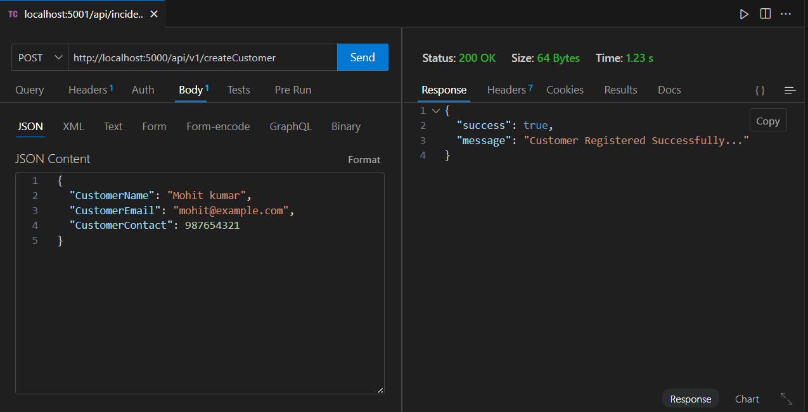

#

**2. Get Customer**

- **Method:** `GET`  
- **URL:** `/api/v1/getCustomer`  
- **Request Body:**

- **Response**
```json
{
  "success": true,
  "response": [
    {
      "_id": "customerId",
      "CustomerName": "John Doe",
      "CustomerEmail": "john@example.com",
      "CustomerContact": 1234567890,
      ...
    }
  ],
  "message": "Customer Fetched Successfully..."
}

```

- **Screenshot**
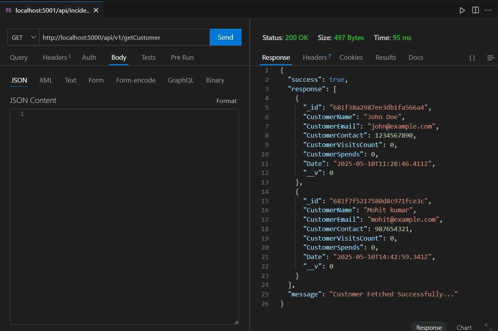


#
**3. Create Order**

- **Method:** `POST`  
- **URL:** `/api/v1/createOrder`  
- **Request Body:**

```json
{
  "CustomerId": "customerId",
  "AmountSpend": 500
}

```
- **Response**
```json
{
  "success": true,
  "message": "Order Registered Successfully..."
}
```
- **Screenshot**
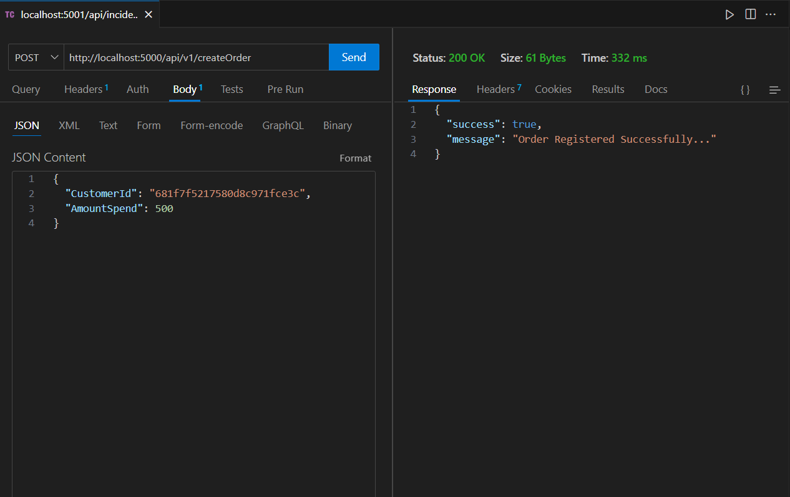

#

**4. Get Orders**

- **Method:** `GET`  
- **URL:** `/api/v1/getOrder`  
- **Request Body:**

- **Response**
```json
{
  "success": true,
  "response": [
    {
      "_id": "orderId",
      "CustomerId": "customerId",
      "AmountSpend": 500,
      ...
    }
  ],
  "message": "Order Fetched Successfully..."
}

```

- **Screenshot**
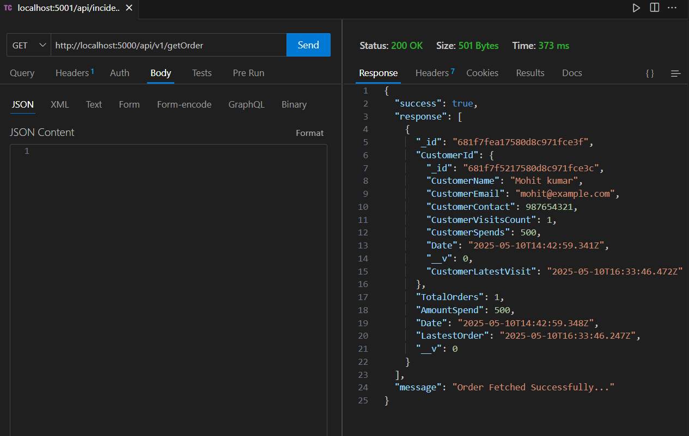

#


**5.Create Campaign**

- **Method:** `POST`  
- **URL:** `/api/v1/createCampaign`  
- **Request Body:**

```json
{
  "UserName": "Admin",
  "Audience": ["customerId"],
  "CurrentStatus": "Pending"
}

```
- **Response**
```json
{
  "success": true,
  "message": "Campaign created successfully",
  "data": {
    "_id": "campaignId",
    "UserName": "Admin",
    ...
  }
}
```
- **Screenshot**
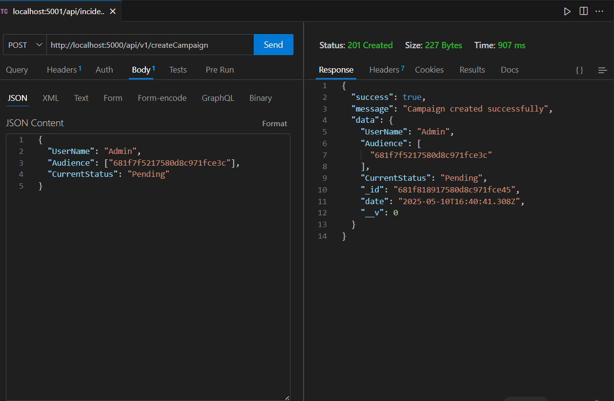

#


**6 Get Campaigns**

- **Method:** `GET`  
- **URL:** `/api/v1/getCampaign`  
- **Request Body:**

- **Response**
```json
[
  {
    "_id": "campaignId",
    "UserName": "Admin",
    "Audience": ["customerId"],
    ...
  }
]
```

- **Screenshot**
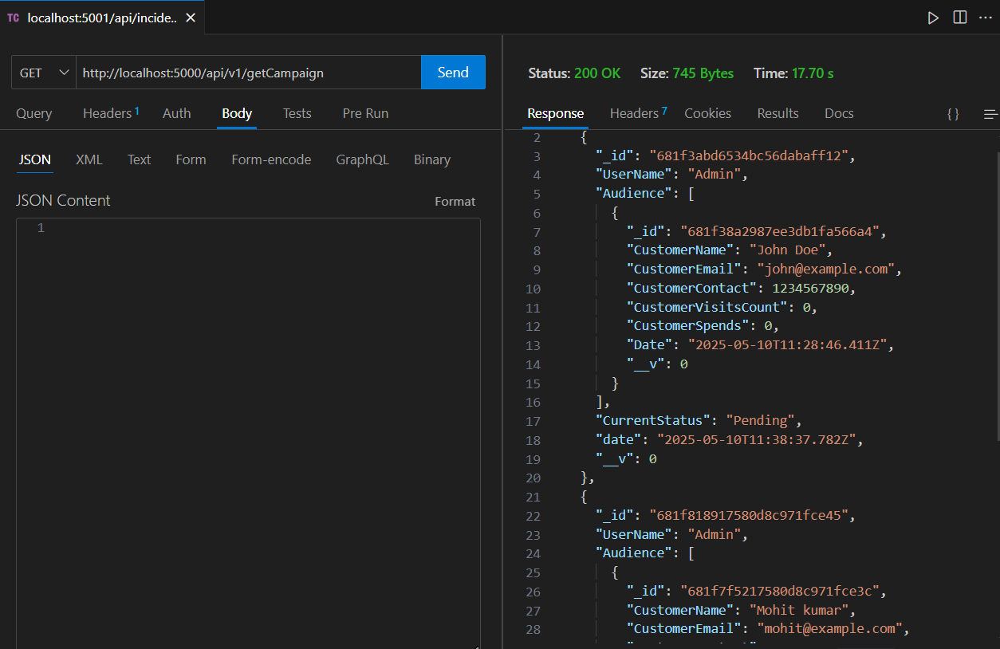
#


**7. Send Campaign**

- **Method:** `POST`  
- **URL:** `/api/v1/sendCampaign`  
- **Request Body:**

- **Response**
```json
{
  "message": "Campaign sent successfully"
}
```

- **Screenshot**

**BEFORE**

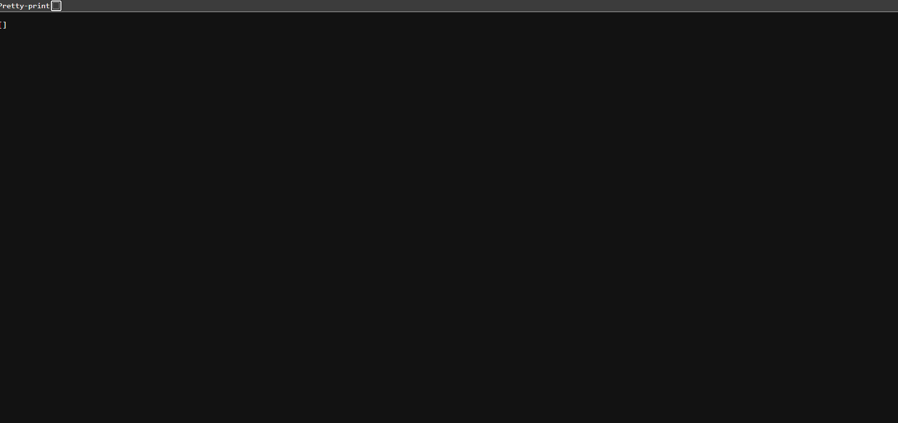
**SEND**

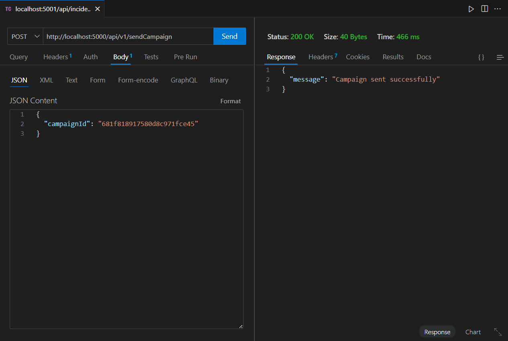


#

**8. Vendor API**

- **Description**: The dummy vendor API simulates message delivery.
- **screenshot**
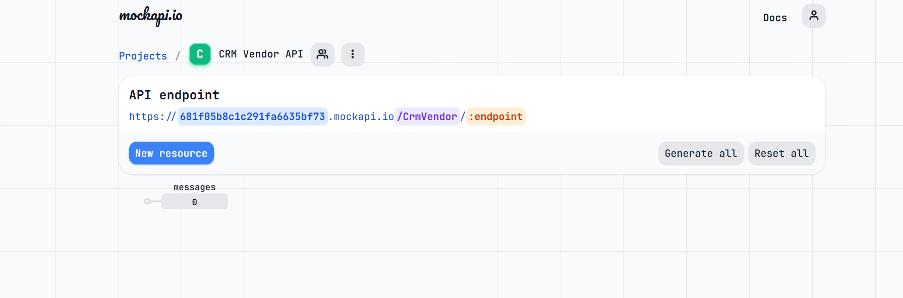


#
**9. Update Receipt**
- **Method:** `POST`  
- **URL:** `/api/v1/updateReceipt`  
- **Request Body:**
```json
{
  "campaignId": "campaignId",
  "CustomerId": "customerId",
  "CurrentStatus": "SENT"
}
```

- **Response**
```json
{
  "message": "Status updated successfully"
}
```
- **Screenshots**
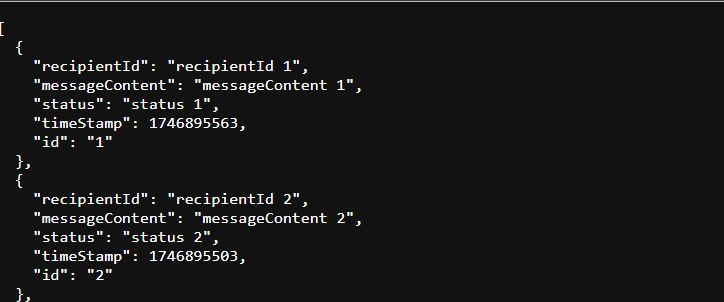

#
# Authentication

- **Google OAuth:**
  - **Login:** `/api/v1/google`
  - **Callback:** `/api/v1/google/callback`
  - **Logout:** `/api/v1/logout`

# Health Check

- **Method:** `GET`
- **URL:** `/api/v1/health`
- **Response:**

```json
{
  "status": "success",
  "message": "API is running"
}
```


